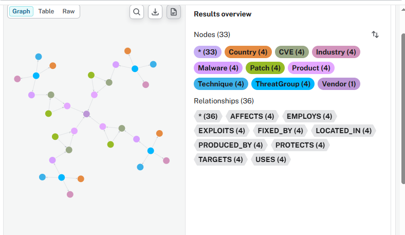
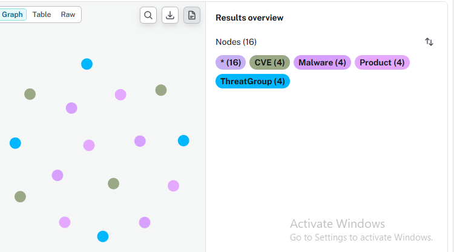
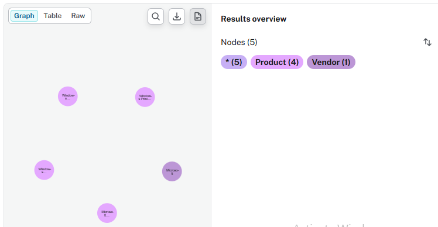

# Cyber Attack Knowledge Graph

## Overview

This project demonstrates a cybersecurity knowledge graph built using Neo4j. It models relationships between threat groups, malware, attack techniques, vulnerabilities (CVEs), software products, vendors, security patches, industries, and countries.

The graph enables security analysts to explore attack chains, identify affected products, understand threat actor behavior, and analyze mitigation paths.

---

## Screenshots

### Graph Overview



### Attack Chain



### Products and Vendors



## Graph Statistics

- Nodes: 36
- Relationships: 36
- Node Labels: 9
- Relationship Types: 9

### Node Labels

- ThreatGroup
- Malware
- Technique
- CVE
- Product
- Vendor
- Patch
- Industry
- Country

### Relationship Types

- USES
- EMPLOYS
- EXPLOITS
- AFFECTS
- PRODUCED_BY
- FIXED_BY
- PROTECTS
- TARGETS
- LOCATED_IN

---

## Folder Structure

```
cyber-attack-knowledge-graph/
├── cypher/
├── data/
├── docs/
├── images/
└── README.md
```

---

## Example Queries

### Threat Groups and Malware

```cypher
MATCH (tg:ThreatGroup)-[:USES]->(m:Malware)
RETURN tg.name, m.name;
```

### Complete Attack Chain

```cypher
MATCH (tg:ThreatGroup)-[:USES]->(m:Malware)
      -[:EXPLOITS]->(c:CVE)
      -[:AFFECTS]->(p:Product)
RETURN tg, m, c, p;
```

### Products and Vendors

```cypher
MATCH (p:Product)-[:PRODUCED_BY]->(v:Vendor)
RETURN p.name, v.name;
```

---

## Technologies

- Neo4j
- Cypher
- CSV Import

---

## Author

Abu Bakarr
